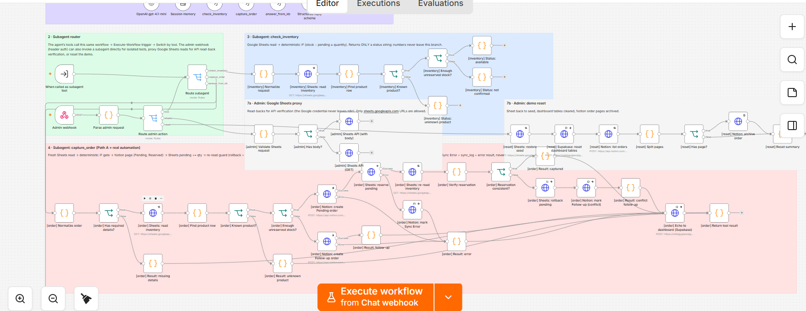
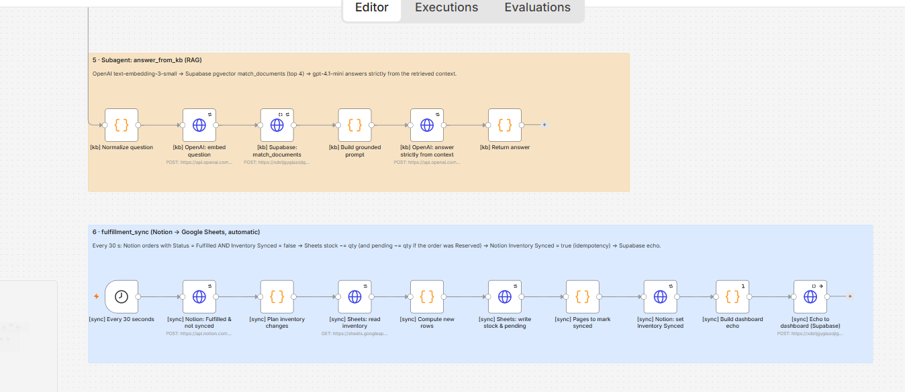

# How Loomhaus works

## One n8n workflow, seven sections

Everything runs in a single n8n workflow ([export](../n8n/workflows/loomhaus.json)), generated by [`scripts/build_n8n.py`](../scripts/build_n8n.py). The canvas is split into labelled sections:

| # | Section | Starts from | What happens |
|---|---|---|---|
| 1 | Orchestrator | `Chat webhook` | Injection filter → AI Agent → reply check → respond → copy the trace to Supabase |
| 2 | Subagent router | `When called as subagent tool`, `Admin webhook` | Sends each call to the right branch |
| 3 | check_inventory | router | Sheet read → IF → status only |
| 4 | capture_order | router | Sheet read → IF → Notion → Sheet → re-read check → copy to Supabase |
| 5 | answer_from_kb | router | Embed the question → Supabase search → answer from the results |
| 6 | fulfillment_sync | `Every 30 seconds` | Fulfilled Notion orders → Sheet; a second branch copies the Sheet to the dashboard |
| 7 | Admin + reset | `Admin webhook` | Sheet read-back for tests, direct subagent tests, demo reset |

The agent's three tools are n8n "Call Workflow" tools that point back at this same workflow. A tool call enters through `When called as subagent tool`, and the `Route subagent` switch sends it to its section.


<details>
<summary>Subagent sections (router, check_inventory, capture_order, admin)</summary>



</details>

<details>
<summary>Knowledge base and fulfillment sync</summary>



</details>

## The orchestrator agent

- **Model:** OpenAI `gpt-4.1-mini`, temperature 0.2
- **Memory:** the last 10 messages of the chat session. The dashboard's **New customer** button starts a new session with empty memory.
- **Tools:** only `check_inventory`, `capture_order` and `answer_from_kb`
- **Output:** has to match `{ intent, reply_text }` (n8n Structured Output Parser)
- The trace under each reply is built from the tools the agent actually called, not from what the model says it did.

## The subagents

### check_inventory(product, quantity)

1. Matches the product name to the catalog ("blue hoodie" → Harbor Blue Hoodie).
2. Reads the row from the Google Sheet.
3. IF node: `stock − pending ≥ quantity`.
4. Returns `available`, `not_confirmed` or `unknown_product`. The numbers stay inside this branch.

### capture_order(customer_name, contact, product, quantity, notes)

1. Checks that a name and an email or phone number were given (otherwise returns `missing_details`).
2. Reads the Sheet again and runs the same IF check.
3. **Enough stock:** creates the Notion page (`Pending`, `Reserved` ticked), then writes `pending + quantity` to the Sheet, then reads the row once more. If `pending` is now above `stock`, it undoes the reservation and changes the order to `Follow-up`.
4. **Not enough stock:** creates the Notion page as `Follow-up` and leaves the Sheet alone.
5. **Something fails:** if Notion fails, nothing is reserved. If the Sheet fails after the page exists, the page becomes `Sync Error`. Either way a row goes to `sync_log` and the agent gets `error`, so it never confirms a half-written order.
6. Copies the result to Supabase for the dashboard. If that copy fails, the order is still correct; only the dashboard is behind.

### answer_from_kb(question)

1. Embeds the question with `text-embedding-3-small`.
2. Finds the 4 closest chunks of the knowledge base (`kb/*.md`) in Supabase pgvector.
3. `gpt-4.1-mini` answers only from those chunks, or replies "I don't know based on the store's policies."

## Fulfillment sync

Every 30 seconds n8n asks Notion for orders with `Status = Fulfilled` and `Inventory Synced` unticked. For each product it subtracts the quantity from `stock` (and from `pending`, if the order had reserved units), writes the Sheet once, then ticks `Inventory Synced` so the same order is never applied twice.

A second branch of the same trigger reads the Sheet and copies any changed rows to the dashboard, so manual edits in the Sheet show up too.

## Dashboard and Supabase

| Table | Shown as | Filled by |
|---|---|---|
| `live_state` | Inventory (same rows and columns as the Sheet, plus a status) | capture_order, fulfillment_sync, the 30 s Sheet copy, reset |
| `order_feed` | Orders (names shortened to "Alex K.", no contact details) | capture_order, fulfillment_sync |
| `agent_trace` | Agent trace | orchestrator |
| `documents` | not shown (knowledge base) | `scripts/ingest_kb.py` |
| `sync_log` | not shown (failure log) | error branches |

The browser uses Supabase's public key, which can only read the first three tables. The dashboard subscribes to Realtime, so it updates without refreshing.

**Reset demo** (no key needed) archives every Notion order, releases the units those orders still reserve, and clears the order feed and trace. It never overwrites `stock`. `python scripts/reset_demo.py --seed` also restores the Sheet to its starting values (admin only).

## Prompt-injection defence: where it is in n8n

| Layer | n8n node(s) | What it does |
|---|---|---|
| 1. No dangerous tools | the 3 tool nodes under `Loomhaus Orchestrator`, and their sections | Nothing can discount, change a price or read orders. Stock numbers never reach the agent. |
| 2. Filter before the AI | `Pre-filter (injection guard)` → `Blocked by pre-filter?` → `Refusal response` | Pattern check on every message. A match gets a fixed reply and never reaches the model. |
| 3. Instructions | `Loomhaus Orchestrator` → Options → System Message | Customer text is data, not instructions; no admin mode; how to phrase each tool result; a canary string. |
| 4. Fixed output + final check | `Structured reply schema`, `Finalize reply (output guard)` | The reply must be `{intent, reply_text}`; the final Code node replaces replies that leak the canary or stock counts, or that probe several quantities. |

<details>
<summary>What the filter catches</summary>

Nine categories: instructions override ("ignore previous instructions"), system-prompt extraction, fake admin or developer mode, markup injection (`<system>`, `[INST]`), discount or coupon requests, free items, price changes, other customers' data, and exact-stock or maximum-quantity questions. Each category has its own fixed reply (for example, discounts point to the newsletter). The patterns are narrow, so a normal question like "Is there free shipping?" still reaches the agent.

</details>

<details>
<summary>Output schema</summary>

```json
{
  "type": "object",
  "additionalProperties": false,
  "required": ["intent", "reply_text"],
  "properties": {
    "intent": { "type": "string", "enum": ["faq", "check_availability", "capture_order", "refuse"] },
    "reply_text": { "type": "string" }
  }
}
```

There is no field for a discount, a price or a number.

</details>

## Limitations

- **Google Sheets has no transactions.** The re-check and re-read catch over-reservation, but two orders arriving in the same second could both pass before either writes. A real store would keep reservations in a database.
- **The filter is pattern-based.** It's a cheap first layer: 4 of the 10 test attacks got past it and were stopped by the later layers.
- **Chat memory lives in n8n's memory** and resets if n8n restarts.
- **Fulfillment is polled** every 30 seconds instead of using Notion webhooks.
